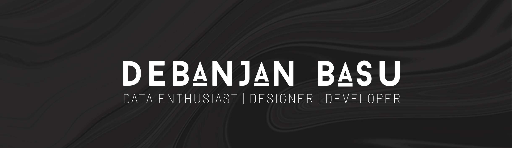

<h2>Hey there! 👋</h2>

 

I'm Debanjan Basu! 
- <i>Currently:</i> MCA Student at Christ (Deemed to be University), Bangalore. 
- <i>Previously:</i> BSC CS Student at St. Xavier's College(Autonomous), Kolkata.

<h2>💻 Interested in </h2>

- Data Analysis and Visualization
- Full Stack Web Development
- Software Engineering

<h2> About Debanjan Basu⚡:</h2>

A Computer Science student with expertise in data analysis, web development and designing, adept at leveraging data-driven
insights to inform business decisions. Proficient in frontend web development and utilizing data visualization tools to present
complex information clearly and visually appealingly. Highly detail-oriented and have a solid ability to conceptualise and design
user-friendly interfaces for optimal user experiences.
 
- Write to me: [basu.debanjan00@gmail.com](mailto:basu.debanjan00@gmail.com)

<h2>📫 How to reach me:</h2>

 
